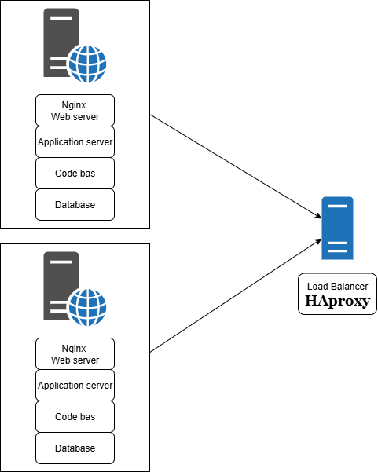

# Distributed web infrastructure

## For every additionale element why you adding it
- HAProxy: To distribute the load between servers and avoid overload Nginx: To serve static files quickly and proxy to the application Application server: To execute the application's business code Application files: To have the code available on each server MySQL: To store data with redundancy

## What distribution algorithm your load balancer is configured with and how it works
Round Robin: Requests are sent in turn to each server (1→2→1→2...) 
- Simple and fair
- Each server receives the same number of requests

## Active-Active vs Active-Passive:
Active-Active (our setup): Both servers handle traffic simultaneously
Active-Passive: Only 1 server handles traffic, the other waits on standby
Difference: Active-Active uses resources better, Active-Passive is simpler but wastes one server.
How Primary-Replica works:

## Write: Application writes to Primary
Replication: Primary automatically copies to Replica
Read: Application can read from Replica

## Primary vs Replica difference for the application:
Primary: Receives all INSERT, UPDATE, DELETE
Replica: Receives SELECT (reads only)
The application must know where to send each type of query

## SPOF (Single Points of Failure):
HAProxy load balancer (if it fails, everything stops)
Primary database (if it fails, no more writes possible)

## Security:
No firewall = ports open to attacks
No HTTPS = data in plain text, interception possible

## Monitoring:
No monitoring = we can't see problems coming
No alerts when failures occur
