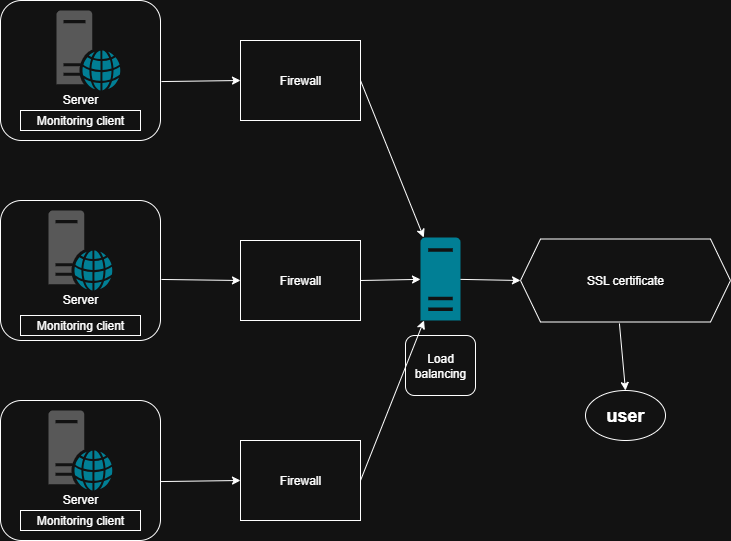

# secure web infrastructure

 Secured_web_infrastructure
## Why each additional element is added:
3 Firewalls: Each server needs its own firewall to control network access and block unauthorized traffic - only allowing HTTP/HTTPS ports.
SSL Certificate: Enables HTTPS encryption for www.foobar.com to protect data transmission and establish trust with users.
3 Monitoring Clients: Sumologic agents on each server collect performance data, logs, and metrics for proactive monitoring and issue detection.

### How to monitor your web server's QPS.
They check that there are no errors and that there is sufficient CPU and memory.
They send alerts if something goes wrong.

### What is a firewall
They only allow normal web traffic (ports 80 and 443)
They protect against attacks.

## Why traffic is served over HTTPS:
HTTPS encrypts data between users and servers, authenticates server identity, ensures data integrity

## problems related to this infrastructure:

### SSL terminated at the load balancer:
Problem: Between the load balancer and the servers, it is no longer encrypted.
Risk: If someone hacks into the internal network, they can see the data.
Solution: Encrypt up to the servers.

### A single MySQL server for writing:
Problem: If this server goes down, nothing can be saved.
Risk: Data loss, site downtime.
Solution: Have multiple servers that can write.

### All servers have everything:
Problem: Each server has a database + web + application.
Risks:
Waste of resources.
More complex to manage.
More things that can fail.
